# Torklio — App Connection Map

> Read-only analysis. No files were changed to produce this document.
> Generated: June 29, 2026

---

## 1. High-Level Architecture Diagram

This diagram shows the major areas of the app and how they connect to each other and to shared services.

```mermaid
graph TD
    %% ── Customer-Facing ──────────────────────────────────
    subgraph PUBLIC["🌐 Customer-Facing (Public)"]
        BOOKING["booking.html\nPublic Booking Page"]
        EMBED["embed.html\niFrame Wrapper"]
        WAITING["waiting_room.html\nCustomer Waiting Room"]
        INDEX["index.html\nLanding / Demo Reset"]
        SIGNUP["signup.html\nShop Signup Flow"]
    end

    %% ── Shop Dashboard ───────────────────────────────────
    subgraph SHOP["🏠 Shop Dashboard"]
        DASH["dashboard.html\nMain Dashboard"]
        RO["repair-orders.html\nRepair Orders"]
        APPT["appointments.html\nAppointments Scheduler"]
        APPT2["appointments-v2.html\nAppointments v2 ⚠️ duplicate"]
        MONITOR["live_monitor.html\nLive Bay Monitor"]
        REPORTS["reports.html\nReports"]
        POS["pos.html\nPoint of Sale"]
    end

    %% ── CRM ──────────────────────────────────────────────
    subgraph CRM["👥 CRM & Customers"]
        CRMPAGE["crm.html\nCRM Command Center"]
        QUOTES["quotes.html\nQuotes / Estimates"]
    end

    %% ── Operations ───────────────────────────────────────
    subgraph OPS["⚙️ Operations"]
        INVOICES["invoices.html\nInvoices & Finance"]
        INVENTORY["inventory.html\nInventory / Parts"]
        MARKETING["marketing.html\nMarketing & Campaigns"]
        TEAM["team.html\nTeam / Schedule"]
        SETTINGS["settings.html\nSettings"]
    end

    %% ── Platform (SaaS Admin) ────────────────────────────
    subgraph PLATFORM["🔑 Platform (SaaS Admin)"]
        PLATFORMPAGE["platform.html\nAdmin: Manage Shops"]
    end

    %% ── Data Layer ───────────────────────────────────────
    subgraph DATA["💾 Data Layer"]
        DB["lib/data.js\nlocalStorage (ab_ prefix)\n52 data keys"]
        WORKFLOW["lib/workflow.js\nCRM Events, Entity Links\nFollow-up Tasks"]
    end

    %% ── Shared Utilities ─────────────────────────────────
    subgraph LIB["🛠️ Shared Utilities"]
        UTIL["lib/util.js\nFormatters, RO Transitions\nCustomer/Vehicle Helpers"]
        AUTH["lib/auth.js\nRole Definitions\nPermission Checks"]
        NAV["lib/nav.js\nSidebar Nav, Toast\nConfirm Dialog"]
        EXPORT["lib/export.js\nCSV, JSON, Print\nClipboard, ICS, Preview"]
    end

    %% ── Connections ──────────────────────────────────────
    EMBED -->|"iframes"| BOOKING
    BOOKING -->|"submits booking → creates customer"| DB
    BOOKING -->|"booking confirmed →"| RO

    INDEX -->|"demo reset"| DB
    SIGNUP -->|"creates shop account"| DB

    DASH --> DB
    DASH --> CRMPAGE
    DASH --> RO
    RO --> APPT
    RO --> INVOICES
    APPT --> RO
    MONITOR --> RO
    POS --> INVOICES
    POS --> DB

    CRMPAGE --> QUOTES
    CRMPAGE --> MARKETING
    CRMPAGE --> DB
    CRMPAGE --> WORKFLOW

    QUOTES --> INVOICES
    QUOTES --> RO

    INVOICES --> DB
    INVENTORY --> DB
    MARKETING --> DB
    MARKETING --> WORKFLOW
    TEAM --> DB
    SETTINGS --> DB

    PLATFORMPAGE --> DB

    WAITING -->|"reads RO status"| DB

    %% All pages → shared lib
    DASH & RO & APPT & CRMPAGE & QUOTES & INVOICES & INVENTORY --> UTIL
    MARKETING & TEAM & SETTINGS & MONITOR & POS & REPORTS --> UTIL
    DASH & RO & APPT & CRMPAGE & QUOTES & TEAM & SETTINGS --> AUTH
    DASH & RO & APPT & CRMPAGE & QUOTES & INVOICES --> NAV
    MARKETING & TEAM & SETTINGS & INVENTORY & REPORTS --> NAV
    UTIL --> DB
    AUTH --> DB
    WORKFLOW --> DB
    NAV --> DB
```



---

## 2. File/Module Connection Diagram

This diagram shows the actual JS file dependencies — which file loads which.

```mermaid
graph LR
    %% ── HTML → App Shell Modules ─────────────────────────
    subgraph ENTRY["HTML Entry Points"]
        H_DASH["dashboard.html"]
        H_RO["repair-orders.html"]
        H_APPT["appointments.html"]
        H_APPT2["appointments-v2.html ⚠️"]
        H_CRM["crm.html"]
        H_MKT["marketing.html"]
        H_TEAM["team.html"]
        H_INV["inventory.html"]
        H_INVOI["invoices.html"]
        H_QUOT["quotes.html"]
        H_POS["pos.html"]
        H_RPT["reports.html"]
        H_SET["settings.html"]
        H_MON["live_monitor.html"]
        H_WAIT["waiting_room.html"]
        H_BOOK["booking.html"]
        H_EMBED["embed.html"]
        H_SIGN["signup.html"]
        H_PLAT["platform.html"]
        H_IDX["index.html"]
    end

    %% ── App Shell Modules ────────────────────────────────
    subgraph SHELLS["App Shell Modules"]
        M_DASH["modules/dashboard.js"]
        M_RO["modules/repair-orders.js"]
        M_APPT["modules/appointments.js"]
        M_APPT2["modules/appointments-v2.js ⚠️"]
        M_CRM["modules/crm/crm-app.js"]
        M_MKT["modules/marketing/mkt-app.js"]
        M_TEAM["modules/team/team-app.js"]
        M_INV["modules/inventory/inventory-app.js"]
        M_INVOI["modules/invoices/invoices-app.js"]
        M_QUOT["modules/quotes/quotes-app.js"]
        M_POS["modules/pos.js"]
        M_RPT["modules/reports.js"]
        M_SET["modules/settings.js"]
        M_MON["modules/live-monitor.js"]
        M_WAIT["modules/waiting-room.js"]
        M_BOOK["modules/booking.js"]
        M_SIGN["modules/signup.js"]
        M_PLAT["modules/platform.js"]
    end

    %% ── Entry → Shell wiring ─────────────────────────────
    H_DASH -->|"dynamic import"| M_DASH
    H_RO -->|"dynamic import"| M_RO
    H_APPT -->|"dynamic import"| M_APPT
    H_APPT2 -->|"dynamic import"| M_APPT2
    H_CRM -->|"dynamic import"| M_CRM
    H_MKT -->|"dynamic import"| M_MKT
    H_TEAM -->|"dynamic import"| M_TEAM
    H_INV -->|"dynamic import"| M_INV
    H_INVOI -->|"dynamic import"| M_INVOI
    H_QUOT -->|"dynamic import"| M_QUOT
    H_POS -->|"dynamic import"| M_POS
    H_RPT -->|"dynamic import"| M_RPT
    H_SET -->|"dynamic import"| M_SET
    H_MON -->|"dynamic import"| M_MON
    H_WAIT -->|"dynamic import"| M_WAIT
    H_BOOK -->|"dynamic import"| M_BOOK
    H_SIGN -->|"dynamic import"| M_SIGN
    H_PLAT -->|"dynamic import"| M_PLAT
    H_EMBED -->|"iframes"| H_BOOK

    %% ── CRM sub-modules ──────────────────────────────────
    M_CRM --> CRM_DASH["crm/crm-dashboard.js"]
    M_CRM --> CRM_PIPE["crm/pipeline.js"]
    M_CRM --> CRM_LEADS["crm/leads.js"]
    M_CRM --> CRM_CUST["crm/customers.js"]
    M_CRM --> CRM_WS["crm/my-workspace.js"]
    M_CRM --> CRM_DRW["crm/crm-drawers.js"]
    CRM_DASH --> CRM_OUT["crm/outreach.js"]
    CRM_LEADS --> CRM_OUT
    CRM_CUST --> CRM_OUT
    CRM_WS --> CRM_OUT
    CRM_WS --> CRM_DRW
    CRM_DRW -->|"dynamic import to avoid circular"| CRM_CUST
    CRM_DRW -->|"dynamic import to avoid circular"| CRM_LEADS

    %% ── Marketing sub-modules ────────────────────────────
    M_MKT --> MKT_DASH["marketing/mkt-dashboard.js"]
    M_MKT --> MKT_SEG["marketing/segments.js"]
    M_MKT --> MKT_CAMP["marketing/mkt-campaigns.js"]
    M_MKT --> MKT_AUTO["marketing/mkt-automations.js"]
    MKT_DASH -->|"setCampaignPrefill"| M_MKT
    MKT_CAMP -->|"takeCampaignPrefill"| M_MKT

    %% ── Team sub-modules ─────────────────────────────────
    M_TEAM --> TEAM_SCHED["team/schedule.js"]
    M_TEAM --> TEAM_EMP["team/employees.js"]
    TEAM_SCHED -->|"openMyPtoRequestModal"| TEAM_EMP
    TEAM_SCHED -->|"drawer open/close"| M_TEAM
    TEAM_EMP -->|"drawer open/close"| M_TEAM
    TEAM_ROLES["team/roles.js ⚠️ orphan"]

    %% ── Inventory sub-modules ────────────────────────────
    M_INV --> INV_DASH["inventory/inv-dashboard.js"]
    M_INV --> INV_STOCK["inventory/inv-stock.js"]
    M_INV --> INV_PO["inventory/inv-purchase-orders.js"]
    M_INV --> INV_XFER["inventory/inv-transfers.js"]
    M_INV --> INV_RET["inventory/inv-returns-counts.js"]
    M_INV --> INV_SUP["inventory/inv-suppliers-integrations.js"]
    INV_STOCK --> M_INV
    INV_PO --> M_INV
    INV_XFER --> M_INV
    INV_RET --> M_INV
    INV_SUP --> M_INV

    %% ── Invoices sub-modules ─────────────────────────────
    M_INVOI --> INVOI_DASH["invoices/inv-dashboard.js"]
    M_INVOI --> INVOI_CUST["invoices/inv-customers.js"]
    M_INVOI --> INVOI_EST["invoices/inv-estimates.js"]
    M_INVOI --> INVOI_LIST["invoices/inv-invoices-list.js"]
    M_INVOI --> INVOI_PAY["invoices/inv-payments.js"]
    M_INVOI --> INVOI_CN["invoices/inv-credit-notes.js"]
    M_INVOI --> INVOI_EXP["invoices/inv-expenses.js"]
    M_INVOI --> INVOI_ITEMS["invoices/inv-items.js"]
    M_INVOI --> INVOI_CLOSE["invoices/inv-closeout.js"]
    M_INVOI --> INVOI_ACCT["invoices/inv-accounting-export.js"]
    INVOI_DASH -->|"invoiceAccessLevel"| M_INVOI
    INVOI_LIST -->|"drawer open/close"| M_INVOI
    INVOI_CN -->|"drawer open/close"| M_INVOI
    INVOI_EXP -->|"drawer open/close"| M_INVOI
    INVOI_ITEMS -->|"drawer open/close"| M_INVOI

    %% ── Quotes sub-modules ───────────────────────────────
    M_QUOT --> QUOT_DASH["quotes/quotes-dashboard.js"]
    M_QUOT --> QUOT_BUILD["quotes/quote-builder.js"]
    M_QUOT --> QUOT_TMPL["quotes/quote-templates.js"]
    QUOT_DASH --> QUOT_DET["quotes/quote-detail.js"]
    QUOT_BUILD --> QUOT_DET
    QUOT_BUILD -->|"takeBuilderPrefill, refresh"| M_QUOT
    QUOT_TMPL -->|"setBuilderPrefill"| M_QUOT
    QUOT_DET -->|"drawer open/close, refresh"| M_QUOT

    %% ── Dashboard role system ────────────────────────────
    M_DASH --> ROLE_DASH["modules/role-dashboards.js"]
    ROLE_DASH --> DASH_WID["modules/dashboard-widgets.js"]

    %% ── Shared lib (all modules depend on these) ─────────
    LIB_DATA["lib/data.js\n💾 localStorage"]
    LIB_UTIL["lib/util.js"]
    LIB_AUTH["lib/auth.js"]
    LIB_NAV["lib/nav.js"]
    LIB_WF["lib/workflow.js"]
    LIB_EXP["lib/export.js"]

    LIB_UTIL --> LIB_DATA
    LIB_UTIL --> LIB_WF
    LIB_AUTH --> LIB_DATA
    LIB_AUTH --> LIB_UTIL
    LIB_NAV --> LIB_DATA
    LIB_NAV --> LIB_UTIL
    LIB_WF --> LIB_DATA
```



---

## 3. ASCII Flow Diagram

The main user journeys from first contact to repeat business:

```
CUSTOMER JOURNEY
================

  Customer visits booking page
       │
       ▼
  booking.html / embed.html
  (Service picker → date/time → vehicle → contact → submit)
       │
       │ util.submitBooking() — creates:
       ├──► ab_bookings (pending)
       └──► ab_customers (upsert)
            ab_vehicles  (upsert)
       │
       ▼
  SHOP DASHBOARD ─── dashboard.html
  "Pending Requests" panel
       │
       │ util.confirmBooking() — creates:
       ├──► ab_jobs (RO, status: scheduled)
       └──► booking.status = confirmed
       │
       ▼
  repair-orders.html ──── Repair Order list
       │
       ├──► appointments.html ── Schedule board (by tech / time)
       │
       ├──► live_monitor.html ── Bay view (drag RO into bay)
       │         │
       │    util.startJob() → status: in_progress
       │    util.markReady() → status: ready
       │
       ├──► util.createInvoiceFromRO() → invoices.html
       │         │
       │    util.recordPayment() → pos.html
       │         │
       │    status: closed
       │
       ▼
  crm.html ──── Customer Record created/updated
       │
       ├──► Follow-up tasks (workflow.js)
       ├──► Quotes pipeline (quotes.html)
       │         │
       │    util.convertQuoteToRO() → back to repair-orders.html
       │
       └──► marketing.html
                 │
            Campaign → Email/SMS (placeholder, not wired)
                 │
            Customer returns ──────────────────────────────┐
                                                           │
  ◄──────────────────────────────────────────────────────┘
       Repeat visit loop


SHOP ADMIN JOURNEY
==================

  signup.html ──► platform.html (SaaS admin view)
       │               │
       │        Manage shops / plans / subscriptions
       │        (all localStorage: pf_* keys)
       │
       ▼
  settings.html
  ├── Shop info, hours, services, bays, coupons
  ├── Roles & Permissions (admin-only)
  ├── Subscription (placeholder)
  └── Data / Demo Reset

  team.html
  ├── Schedule tab (weekly grid, time clock, trade requests)
  └── Employees tab (directory, PTO, add/edit)

  inventory.html
  ├── Dashboard (reorder alerts, channel demand)
  ├── Stock (parts table with search/filter/export)
  ├── Purchase Orders
  ├── Transfers, Returns & Counts
  └── Suppliers & Integrations (placeholder)
```

---

## 4. Feature Area Table

| Feature Area | Files Involved | Data Keys Used | Connects To | Notes / Problems |
|---|---|---|---|---|
| **Landing / Demo** | `index.html` | `ab_settings` (reset trigger) | `lib/data.js` | No real routing; demo-only entry point |
| **Public Booking** | `booking.html`, `embed.html`, `modules/booking.js` | `ab_bookings`, `ab_customers`, `ab_vehicles`, `ab_services`, `ab_settings` | Repair Orders, CRM | `embed.html` is a thin iframe wrapper with no own JS |
| **Waiting Room** | `waiting_room.html`, `modules/waiting-room.js` | `ab_jobs`, `ab_vehicles`, `ab_settings` | Live Monitor, Repair Orders | Customer-facing status board; no auth |
| **Shop Dashboard** | `dashboard.html`, `modules/dashboard.js`, `modules/role-dashboards.js`, `modules/dashboard-widgets.js` | `ab_jobs`, `ab_invoices`, `ab_employees`, `ab_bays`, `ab_customers` | All pages via nav | Role-based dashboard views; 11 roles supported |
| **Repair Orders** | `repair-orders.html`, `modules/repair-orders.js` | `ab_jobs`, `ab_customers`, `ab_vehicles`, `ab_employees`, `ab_bays`, `ab_services` | Appointments, Invoices, CRM, Live Monitor | Core workflow hub; all RO transitions go through `lib/util.js` |
| **Appointments (v1)** | `appointments.html`, `modules/appointments.js` | `ab_jobs`, `ab_employees`, `ab_bays`, `ab_customers`, `ab_vehicles` | Repair Orders, Settings | **Duplicate of v2** — both pages exist, both in the codebase |
| **Appointments (v2)** | `appointments-v2.html`, `modules/appointments-v2.js` | Same as v1 | Repair Orders, Settings | **Duplicate of v1** — unclear which is canonical |
| **Live Monitor** | `live_monitor.html`, `modules/live-monitor.js` | `ab_jobs`, `ab_bays`, `ab_employees`, `ab_customers`, `ab_vehicles` | Repair Orders | Drag-and-drop bay board; `util.moveToBay()`, `util.returnToWaiting()` |
| **CRM** | `crm.html`, `modules/crm/crm-app.js` + 7 sub-modules | `ab_customers`, `ab_vehicles`, `ab_leads`, `ab_followUpTasks`, `ab_entityLinks`, `ab_activityEvents`, `ab_communications` | Quotes, Marketing, Repair Orders | `crm-drawers.js` uses dynamic imports to break circular deps |
| **Quotes / Estimates** | `quotes.html`, `modules/quotes/` (5 files) | `ab_quotes`, `ab_customers`, `ab_vehicles`, `ab_services`, `ab_employees` | CRM, Repair Orders, Invoices | `invoices/inv-estimates.js` also exists — **two estimate systems** |
| **Marketing** | `marketing.html`, `modules/marketing/` (5 files) | `ab_campaigns`, `ab_segments`, `ab_templates`, `ab_automations`, `ab_communications`, `ab_customers` | CRM, Customers | Email/SMS sending is a placeholder; no real send pipeline |
| **Invoices / Finance** | `invoices.html`, `modules/invoices/` (11 files) | `ab_invoices`, `ab_customers`, `ab_expenses`, `ab_creditNotes`, `ab_invoiceItems`, `ab_registers` | Repair Orders, POS, CRM | 11 sub-module files; `inv-estimates.js` overlaps with quotes system |
| **Point of Sale** | `pos.html`, `modules/pos.js` | `ab_sales`, `ab_registers`, `ab_invoices`, `ab_parts`, `ab_customers`, `ab_employees` | Invoices | Register open/close, payment tender |
| **Inventory** | `inventory.html`, `modules/inventory/` (7 files) | `ab_parts`, `ab_purchaseOrders`, `ab_purchaseOrderItems`, `ab_inventoryTransfers`, `ab_inventoryLocations`, `ab_inventoryLocationStock`, `ab_suppliers`, `ab_returns`, `ab_cycleCounts`, `ab_inventoryTransactions` | Repair Orders (parts on ROs), Invoices | Most data reads are real; demand channels are placeholder |
| **Reports** | `reports.html`, `modules/reports.js` | `ab_invoices`, `ab_jobs`, `ab_employees` | All modules (read-only) | No drill-down; limited to revenue, tech stats, capacity |
| **Team** | `team.html`, `modules/team/` (3 active files) | `ab_employees`, `ab_shifts`, `ab_ptoRequests`, `ab_shiftTradeRequests`, `ab_scheduleWeeks`, `ab_timeClockEntries`, `ab_teamMessages`, `ab_teamActivity` | Settings (Roles), Inventory | `team/roles.js` is **dead code** — no longer imported |
| **Settings** | `settings.html`, `modules/settings.js` | `ab_settings`, `ab_services`, `ab_bays`, `ab_employees`, `ab_roles` | All pages (reads shop config) | Roles & Permissions moved here from Team in Session 5 |
| **Platform (SaaS Admin)** | `platform.html`, `modules/platform.js` | `pf_accounts`, `pf_shops`, `pf_subscriptions`, `pf_plans`, `pf_users`, `pf_memberships`, `pf_onboardingProgress` | Signup | Separate key namespace (`pf_`); disconnected from shop data |
| **Signup** | `signup.html`, `modules/signup.js` | `pf_*` keys | Platform | Onboarding flow; writes to platform keys only |
| **Auth / Roles** | `lib/auth.js` | `ab_employees`, `ab_roles`, `ab_settings` (currentUserId) | All modules | Demo-only switcher; no real session/login system |
| **Data Layer** | `lib/data.js` | All `ab_*` and `pf_*` keys | All modules | 52 keys total; localStorage only; no Supabase yet |
| **Workflow / CRM Engine** | `lib/workflow.js` | `ab_activityEvents`, `ab_entityLinks`, `ab_followUpTasks`, `ab_auditLogs` | CRM, Quotes, Invoices, Marketing | Also contains its own seed functions — overlaps with `data.js` |
| **Utilities** | `lib/util.js` | Reads via `db.*` | All modules | Owns all RO lifecycle transitions; customer/vehicle formatters |
| **Navigation** | `lib/nav.js` | `ab_employees`, `ab_settings`, `ab_roles` | All pages | Renders the icon rail sidebar; toast + confirm dialog |
| **Export** | `lib/export.js` | None (pure functions) | Reports, RO, CRM, Schedule, Quotes | CSV, JSON, ICS, print, clipboard, message preview |
| **Design System** | `design-system.html` | None | None | Static reference page; not part of the running app |

---

## 5. Disconnected, Duplicated, or Confusing Areas

### 🔴 Critical — Likely to cause bugs or confusion

1. **Two appointments pages (`appointments.html` + `appointments-v2.html`)**
   Both files exist, both are reachable, both render "Appointments Scheduler." They have separate module files (`appointments.js` and `appointments-v2.js`) with overlapping but not identical code. It is unclear which is the "real" one. Neither is marked deprecated. The nav sidebar only links to one, but the other is accessible by URL.

2. **Two estimate/quote systems**
   `quotes.html` is a full quoting app (5 sub-modules, quote lifecycle, templates, builder). `modules/invoices/inv-estimates.js` also exists inside Invoices. These appear to serve different purposes (CRM-driven quotes vs. invoice-related estimates) but the naming and placement are confusing. The relationship between a Quote and an Estimate is not documented in code.

3. **`modules/team/roles.js` is dead code**
   This file still exists and contains logic for the Roles & Permissions UI. However, since Session 5, it is no longer imported anywhere — `team-app.js` no longer references it, and the feature moved to `modules/settings.js`. The file will never run but may mislead a future developer.

4. **No real authentication**
   `lib/auth.js` is a permission-checking library built on top of a demo switcher (`db.settings().currentUserId`). There is no login page, no session, no JWT. `auth.currentUser()` reads from localStorage. All role enforcement is UI-only. The code itself includes warnings about this ("SECURITY WARNING", "demo/UI-only role filtering") but the gap is large.

5. **Platform data (`pf_*` keys) is completely isolated from shop data (`ab_*` keys)**
   `platform.html` and `signup.html` write to `pf_accounts`, `pf_shops`, etc. The shop app reads from `ab_settings`. There is no connection between "which shop is logged in" and the platform tenant record. A shop created via `signup.html` does not automatically populate `ab_settings`.

### 🟡 Medium — Placeholder features presented as real

6. **Marketing email/SMS sending is not wired**
   `marketing.html` shows campaign metrics (open rate, click rate, revenue influenced) that are marked "simulated." No Resend or Twilio integration exists. The automation system (`mkt-automations.js`) stores automation rules but nothing executes them.

7. **`invoices/inv-accounting-export.js` appears empty or stub**
   This file exists but had no visible `import` statements when scanned — likely a placeholder tab for future QuickBooks/export integration.

8. **`invoices/inv-estimates.js` — purpose unclear**
   This file exists inside the Invoices module but there is a full Quotes module at `quotes.html`. It may be an older stub or a separate "quick estimate" flow. Needs review.

9. **Time clock is demo-only**
   `team.html` shows a Time Clock section with Clock In/Out buttons. The data writes to `ab_timeClockEntries` but there is no payroll calculation, no compliance logic, and the UI explicitly says "demo — no real time-tracking compliance yet."

10. **Inventory demand channels are placeholder**
    `inv-dashboard.js` shows channel demand rows for "Online Store," "Marketplace," "Wholesale/Fleet," and "Supplier Dropship" — all explicitly labeled `placeholder`. No integration exists.

11. **Waitlist in Appointments is not connected**
    The Appointments page has a "Waitlist" section that displays "Waitlist tracking isn't wired up to a real data source in this build."

12. **`embed.html` has no JS of its own**
    It is a pure iframe wrapper for `booking.html?embed=1`. This is intentional but means any embed-specific behavior (e.g., hiding the shop header in the iframe) is handled by a `?embed=1` query param inside `booking.js`.

### 🔵 Low — Structural / naming issues

13. **`inv-dashboard.js` filename collision**
    Both `modules/inventory/inv-dashboard.js` and `modules/invoices/inv-dashboard.js` exist. Same filename, different directories, different content. This will confuse any editor's file-switcher.

14. **`lib/workflow.js` contains its own seed functions**
    `workflow.ensureSeeded()` and `workflow.seedCrmDemoData()` exist alongside `lib/data.js`'s `seed()` function. There are two separate seeding systems for different parts of the data. `workflow.seedDemoLinks()` also exists. These run at different times and are hard to reason about together.

15. **`index.html` is a landing/reset page, not a real homepage**
    The file contains "inject demo data" and "reset demo data" buttons but no marketing content or navigation to the app. It is not the entry point a real customer would see.

16. **`design-system.html` lives at the project root**
    This is a static CSS reference page with no module imports. It is useful for development but would ideally live under `docs/` to keep the root clean.

---

## 6. Recommended Cleanup Plan (Before Adding More Features)

These are ordered by impact. No code should be changed until each item is deliberate and approved.

### Phase A — Remove dead code (low risk, high clarity)

| # | Action | File(s) | Risk |
|---|---|---|---|
| A1 | Delete or archive `modules/team/roles.js` | `team/roles.js` | Low — confirmed not imported anywhere |
| A2 | Rename `modules/inventory/inv-dashboard.js` to `inv-inv-dashboard.js` or `inv-overview.js` to distinguish it from `modules/invoices/inv-dashboard.js` | Both `inv-dashboard.js` files | Low — update one import in each app shell |
| A3 | Move `design-system.html` to `docs/design-system.html` | `design-system.html` | Low — development-only file |

### Phase B — Resolve duplicates (medium risk, high clarity)

| # | Action | File(s) | Risk |
|---|---|---|---|
| B1 | Pick one appointments page as canonical and delete or redirect the other | `appointments.html` vs `appointments-v2.html` and their modules | Medium — audit which features each has before deleting |
| B2 | Clarify the role of `modules/invoices/inv-estimates.js` vs `quotes.html` — either wire them together or delete the stub | `invoices/inv-estimates.js`, `quotes/` | Medium — document the intended flow first |
| B3 | Unify the two seed systems (`data.js:seed()` vs `workflow.js:ensureSeeded()`) into a single ordered init sequence | `lib/data.js`, `lib/workflow.js` | Medium — risk of double-seeding or missed records |

### Phase C — Connect the disconnected (higher effort, needed before launch)

| # | Action | File(s) | Risk |
|---|---|---|---|
| C1 | Wire platform signup → shop settings: when a shop is created via `signup.html`, it should populate `ab_settings` for that shop's session | `modules/signup.js`, `lib/data.js` | High — requires defining the tenant model |
| C2 | Add real authentication: replace demo switcher with Supabase Auth session — `auth.currentUser()` should read a real session, not localStorage | `lib/auth.js`, all pages | High — major architecture change |
| C3 | Wire Marketing send: connect `mkt-campaigns.js` and `mkt-automations.js` to Resend for email and Twilio for SMS | `modules/marketing/` | High — requires API credentials and backend |
| C4 | Connect Invoices accounting export tab to a real export format (QuickBooks IIF, CSV) | `invoices/inv-accounting-export.js` | Medium |

### Phase D — Documentation

| # | Action | Notes |
|---|---|---|
| D1 | Document the booking-to-RO-to-invoice lifecycle in a single diagram (this doc is a start) | The flow exists in code across 3 files; easy to lose |
| D2 | Document which localStorage keys are shop-specific (`ab_*`) vs platform-specific (`pf_*`) | Already separated by prefix; just needs a written note |
| D3 | Mark all placeholder UI sections with a consistent `<!-- PLACEHOLDER -->` HTML comment so they are easy to grep | Makes the gap between "works" and "wired" visible at a glance |
